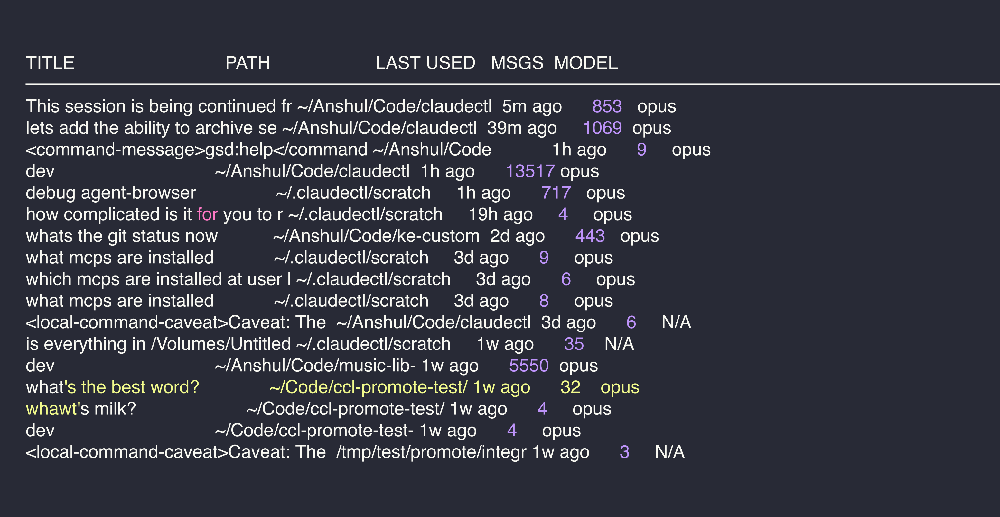
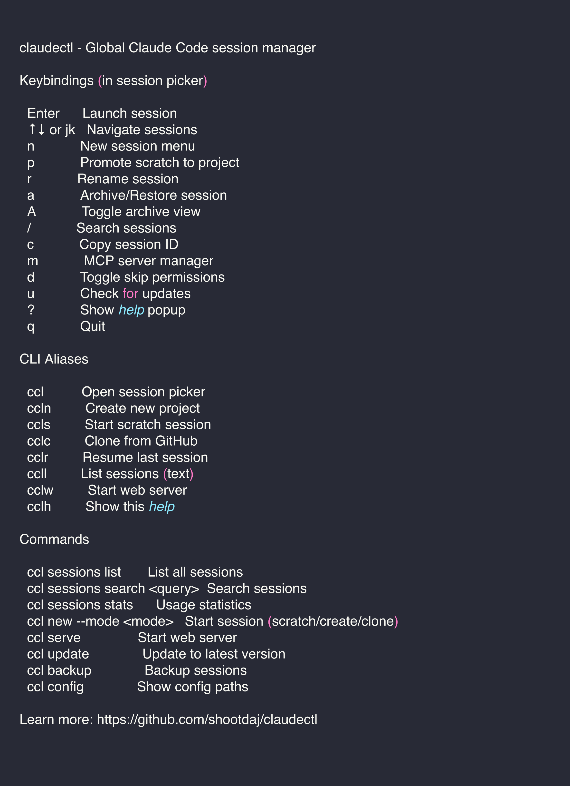

# claudectl

**Your command center for Claude Code.** Browse, search, and launch sessions across all your projects—from one place.


<p align="center">
  
</p>

## Quick Start

```bash
# Install (macOS/Linux)
curl -fsSL https://raw.githubusercontent.com/shootdaj/claudectl/main/install.sh | bash

# Open session picker
ccl

# Or use quick aliases
ccls    # Start a scratch session right now
cclr    # Resume your last session
cclh    # See all commands
```

## Why claudectl?

Claude Code sessions are organized by folder. If you're in `~/myapp`, you only see sessions from that project. **claudectl gives you a global view** - see and launch sessions from any project, all in one place.

**Quality of life features:**
- **Quick aliases** - `ccls` starts a scratch session instantly, `cclr` resumes your last session
- **Session loop** - After Claude exits, you're back in the picker (no re-typing `ccl`)
- **Scratch sessions** - Quick questions without creating a project
- **Promote to project** - Turn that scratch session into a real repo when it grows
- **Full-text search** - Find that session where you fixed the auth bug
- **Remote access** - Access your sessions from your phone via `cclw`

## Installation

### macOS / Linux

```bash
curl -fsSL https://raw.githubusercontent.com/shootdaj/claudectl/main/install.sh | bash
```

### Windows (PowerShell)

```powershell
irm https://raw.githubusercontent.com/shootdaj/claudectl/main/install.ps1 | iex
```

> Windows support is experimental. [Report issues](https://github.com/shootdaj/claudectl/issues) if you encounter problems.

<details>
<summary>More install options</summary>

**Specific version:**
```bash
VERSION=v2.1.0 curl -fsSL https://raw.githubusercontent.com/shootdaj/claudectl/main/install.sh | bash
```

**Development (main branch):**
```bash
VERSION=main curl -fsSL https://raw.githubusercontent.com/shootdaj/claudectl/main/install.sh | bash
```

**Uninstall:**
```bash
curl -fsSL https://raw.githubusercontent.com/shootdaj/claudectl/main/uninstall.sh | bash
```

</details>

## Quick Aliases

Memorize these and you'll fly:

| Alias | What it does |
|-------|--------------|
| `ccl` | Open session picker |
| `ccls` | **S**cratch session - start chatting immediately |
| `cclr` | **R**esume last session |
| `ccln` | **N**ew project (create wizard) |
| `cclc` | **C**lone from GitHub |
| `ccll` | **L**ist sessions (text output) |
| `cclw` | **W**eb server (remote access) |
| `cclh` | **H**elp - show all commands |

## Commands

```bash
# Session management
ccl sessions list              # List all sessions
ccl sessions launch <id>       # Launch specific session
ccl sessions launch --continue # Resume most recent session
ccl sessions search <query>    # Full-text search
ccl sessions stats             # Usage statistics

# New sessions
ccl new                        # Interactive menu
ccl new --mode scratch         # Scratch session
ccl new --mode create          # Create project wizard
ccl new --mode clone           # Clone from GitHub

# Other
ccl serve                      # Start web server
ccl serve --tunnel             # With Cloudflare tunnel
ccl mcp list                   # List MCP servers
ccl backup                     # Backup sessions
ccl update                     # Update claudectl
ccl config                     # Show config paths
ccl help                       # Show all keybindings & aliases
```

## Keybindings

<p align="center">
  
</p>

## Features

**Session Management**
- Global view of all Claude Code sessions
- Full-text search with SQLite FTS5
- Rename sessions with memorable names
- Archive old sessions (hide without deleting)
- Soft delete with restore capability
- Auto-backup every hour

**Workflow Shortcuts**
- Scratch sessions for quick questions
- Promote scratch to real project (creates git repo + GitHub)
- Clone repos directly from picker
- Session loop - returns to picker after Claude exits

**Remote Access**
- Web server with terminal in browser (`ccl serve`)
- Works on mobile (PWA support)
- Cloudflare tunnel for secure remote access
- Password authentication with JWT

**Developer Experience**
- Skip-permissions mode for trusted projects
- MCP server manager
- Agent Expert integration
- Cross-platform (macOS, Linux, Windows)

## Agent Expert Integration

claudectl works with [Agent Expert](https://github.com/shootdaj/agent-expert) - a framework that makes Claude learn and improve over time.

Press `a` to enable auto-install, then every new session gets Agent Expert. Claude will:
- Read expertise files before starting work
- Update expertise after making changes
- Build project-specific knowledge over time

Learn more: [github.com/shootdaj/agent-expert](https://github.com/shootdaj/agent-expert)

## How It Works

claudectl reads from Claude Code's session directory (`~/.claude/projects/`), parses the JSONL transcript files, and provides a unified interface. When you launch a session, it `cd`s to the project directory before starting Claude.

Settings stored in `~/.claudectl/settings.json`:
```json
{
  "skipPermissions": false,
  "autoAddAgentExpert": false
}
```

## Requirements

- [Claude Code](https://claude.ai/code)
- macOS, Linux, or Windows 10/11

## License

MIT
